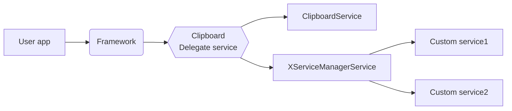

# XServiceManager
## 这是什么?

这是一个系统服务注入框架,允许您不受```SELinux```策略限制直接向```framework```中添加服务.

## 应用场景

- ROM开发可以集成到```aosp```源码中作为```framework```的一部分
- Xposed开发无需改动源码即可注入到```framework```层添加第三方服务

## 工作原理

在Android 5.0以后受限于```SELinux```强制策略影响因此在系统中添加服务需要修改```sepolicy```策略文件这对毫无经验的开发者来说变的非常困难,因此有了```XServiceManager```项目您可以自由的添加服务到```framework```中以提供给其他应用使用. ```XServiceManager```通过劫持托管了系统```clipboard```服务,您的所有服务实际上是由```XServiceManager```代为管理而不是真正的添加到系统的```ServiceManager```中,因此您的服务必须通过```XServiceManager```接口添加调用.



## 如何使用?

> 这里仅介绍```xposed```集成的方法```aosp```集成的方法类似请自行研究

1. 将```XServiceManager```项目克隆至您的工程```git clone git@github.com:jrsen/Xposed-XServiceManager.git```

2. 在您的工程中打开```build.gradle```中添加```implementation project(path: ':xservicemanager')```

3. 编写您的```AIDL```服务

4. 在```Xposed```初始化类中**确认是```framework```进程后**添加初始化代码并添加您的服务

   1. 不依赖系统服务和```Context```
   
      ```java
      if("android".equals(lpparam.packageName)){
          XServiceManager.initForSystemServer();
      	XServiceManager.addService("simple", new SimpleService());
      }
      ```
   
   2. 依赖系统服务和Context
   
      ```java
      if("android".equals(lpparam.packageName)){
          XServiceManager.initForSystemServer();
          XServiceManager.registerService("simple2", new XServiceManager.ServiceFetcher<Binder>()
          {
              @Override
              public Binder createService(Context ctx)
              {
                  return new SimpleService2(ctx);
              }
          });    
      }
      ```
   
5. 在其他应用中使用您的服务

   > 提示:在注入失败的情况下您的服务为空因此在使用服务之前请检查服务对象
   
   ```java
   IBinder binder = XServiceManager.getService("simple");
   if(binder != null){
   	ISimpleService service = ISimpleService.Stub.asInterface(binder);
   	String content = service.readPackageXml();
   }
   ```

## 常见问题

- 无法使用您的服务

   请在初始化之前开启```XServiceManager#debug(true)```调试模式过滤```XServiceManager```日志检查是否有如下提示

   ```
   XServiceManager inject success
   ```

   如果没有这样的提示应该有会有一些其他的异常提示请检查是否是因为您的服务引起的如果不是恭喜您发现了一个BUG请提交PR给我

- 如何在您的服务中存储文件

   您的服务默认属于```system```用户组因此无法在```sdcard```以及您应用内部的文件路径存储数据,您可以选择在```/data/```目录中创建一个新的目录用来存储

   >  请尽量不要分散存储数据因为保持简洁是一个好的习惯

- 调用服务出现```TransactionTooLargeException```

   该错误是由```IPC```数据缓冲区限制引起该限制大约为```1Mb```请避免大量数据交换
   
- 添加服务是否有上限?

   没有限制
## 注意事项

**因为您的服务将在```system_server```进程中运行因此拥有系统最高权限,请尽量确保服务的安全性如API鉴权并且稳定性和可靠性也非常重要在系统进程中发生崩溃可能会导致手机出现不可预知的异常情况**

[English](README.md)